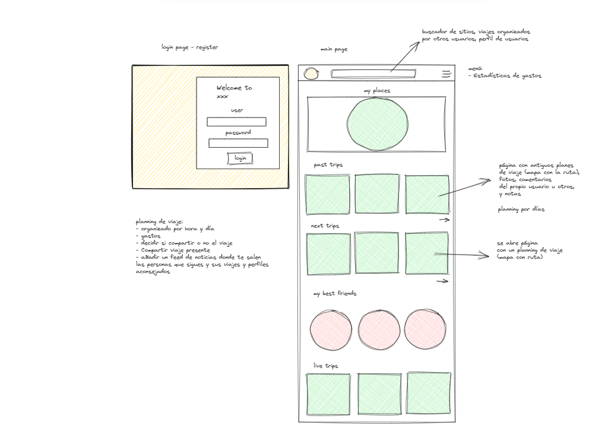
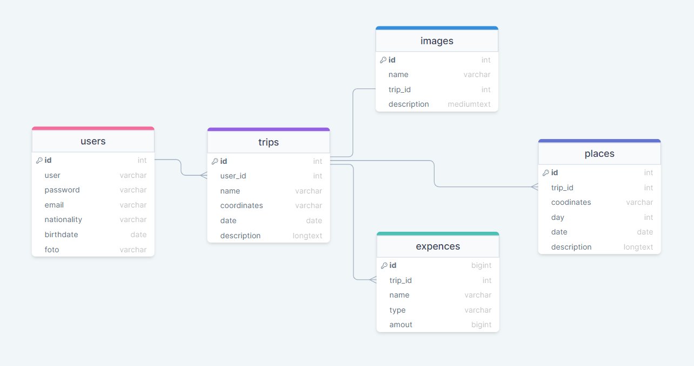

# fspt18-team-1

## Introduction

**Welcome to our project!**

The inspiration for this project came up during our conversations about the significance of effective travel planning and the desire to connect with fellow travelers who share our passion for exploration. Our vision for this website is to create an online community, where individuals can not only share their travel itineraries, captivating photos, and invaluable travel insights but also create new connections with like-minded travelers or reconnect with friends for unforgettable journeys.



## Authors

[Vanessa Cavaco Branco](https://www.linkedin.com/in/vanessacavacobranco/) - **Backend**  

[Elena Sorina Manea](https://www.linkedin.com/in/elena-sorina-manea-12137b111/) - **Bakend**  

[Vinay Font Villanueva](https://www.linkedin.com/in/vinay-font-381a0815a/) - **Frontend**  

## The process and applications used

**1. Database Creation with DrawSQL:**

We initiated the project by designing our database structure using the DrawSQL application. DrawSQL facilitated the creation of our database schema and tables by generating SQL code automatically. 



**2. Backend API Development:**

We developed a robust backend API to handle various functionalities and routes for our application.

- Places:
Created endpoints for managing places, including GET (retrieve all places), POST (add a new place), PUT (edit a place), and DELETE (remove a place).

- Trips:
Established a comprehensive set of routes to manage trips and associated images:

```
GET /images/:trip_id: Retrieves images linked to a specific trip by trip_id.
GET /: Fetches a list of all trips stored in the database.
GET /userTrips: Retrieves trips belonging to the authenticated user.
GET /:trip_id: Provides detailed information about a specific trip, including associated images.
POST /: Creates new trips and allows optional image uploads.
PUT /:trip_id: Updates existing trips, with an option to modify the associated image.
DELETE /:trip_id: Deletes a trip along with its associated image.
```

- Users:
Implemented user-related routes:
POST /register: Allows user registration.
POST /login: Manages user login, with JWT authentication.
GET /profile: Retrieves and displays user profiles based on authentication status.

- JWT Authentication:
We incorporated JSON Web Token (JWT) authentication to ensure secure access to protected routes. This authentication mechanism enhances the security of our application and facilitates user-specific functionalities.

**3. Frontend**

- Created the prototype with [Figma](https://www.figma.com/file/qFSuSCFqdoYipSvS2zuQdD/AppMyTrip?type=whiteboard&node-id=0-1) of the pages for the web application

- Created the Frontend routes, pages and components, that perform CRUD operations on the Database elements by sending requests to the API.

- Finally, applied vanilla CSS Styles paying special attencion to reponsive design, classnaming, custom properties and usability.

### SetUp

**Dependencies**

Run `npm install` in the project folder to install dependencies related to Express (the server).

`cd client and run` and run `npm install` install dependencies related to React (the client).

**Database prep**

Create `.env ` file in project directory and add

```
DB_NAME=tripmanager
DB_PASS=YOUR_PASSWORD
```
(replace YOUR_PASSWORD with your actual password)

Type `mysql -u root -p` to access the MySQL CLI using your password.

Run the following in the MySQL CLI: ALTER USER 'root'@'localhost' IDENTIFIED WITH mysql_native_password BY 'YOUR_PASSWORD'; (replace YOUR_PASSWORD with your actual password)

Run `npm run migrate` in your TERMINAL, in the project folder (not your MySQL CLI! Open a new terminal window for this). This will initiate the database with all the tables.

**Run Your Development Servers**

Run `npm start` in project directory to start the Express server on port 5000

`cd client` and run `npm run dev` to start client server in development mode with hot reloading in port 5173.

### Future features

- Searchbar for travel plans, users, places
- A tool to measure expences during the trip
- A feed with: 
    - Page with your old trips
    - Page with your nextrips
    - Best Friends
    - Live Trips
- Trip plan organized by day/s
- To be able to decide to make your trip pubblic or private


